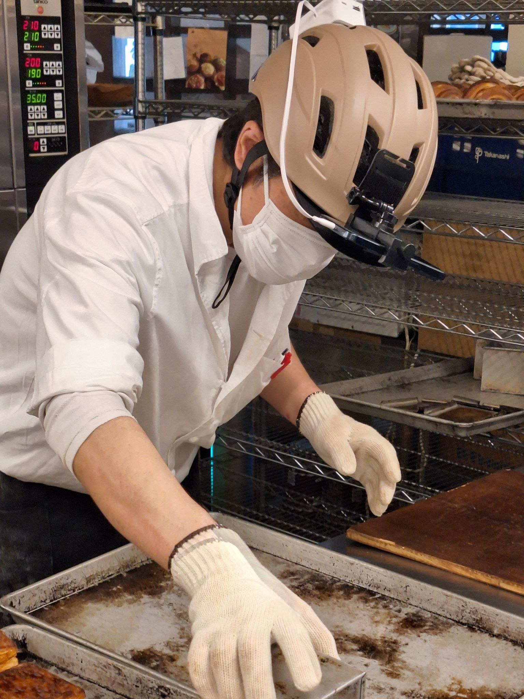

# ヘッドギアで、人件費を大幅に削減できます

> **アーカイブ資料です。** 固定単価、音声を録音しない運用、撮影禁止マーカーなど、現在と異なる条件を含むため配布には使用しません。

RootLensは、店舗や現場で働く方の作業映像を、ロボット・AIの研究開発を行う企業へ販売する事業を運営していました。本資料では、録画できた時間1時間につき1,000円を支払う旧条件を案内しています。

## 進め方

1. **撮影** — スタッフがヘッドギア型カメラを装着し、バックヤードで通常業務の手元を撮影します。旧運用では顔をぼかし、音声は録音しない設計でした。
2. **データ提供** — ロボットやAIが人の作業を学習する素材として、研究開発企業へ販売します。店名や個人名は公表しない想定でした。
3. **撮影協力費** — 品質基準を満たした録画時間1時間につき1,000円を、月次で支払う旧条件です。

## 旧試算例

| 項目 | 金額 |
|---|---:|
| 店舗が支払う時給 | 1,200円 |
| 撮影協力費 | −1,000円 |
| 店舗の実質負担 | 約200円／時 |

録画できる時間は勤務時間の7〜8割を目安とし、最初の50時間を試験価格の対象としていました。

## 当時の案内

- 装着中も両手を空けて通常作業を行えること
- 撮影はバックヤードに限定し、顔をぼかし、音声を録音しないこと
- 見せたくない場所には撮影禁止マーカーを貼り、提供前の確認・削除に応じること

お問い合わせ：RootLens 森 雄大 / contact@rootlens.io / rootlens.io
