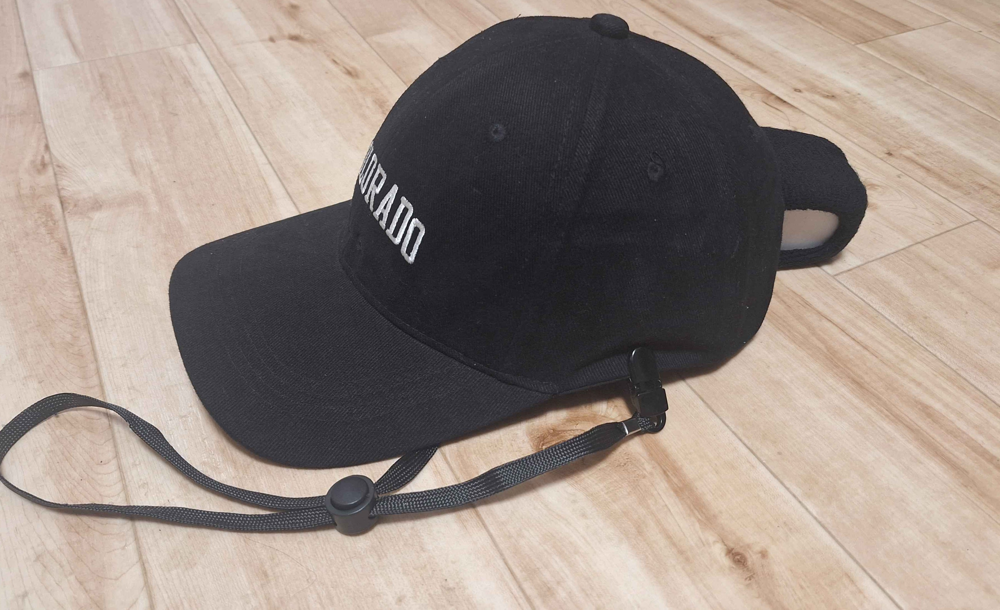
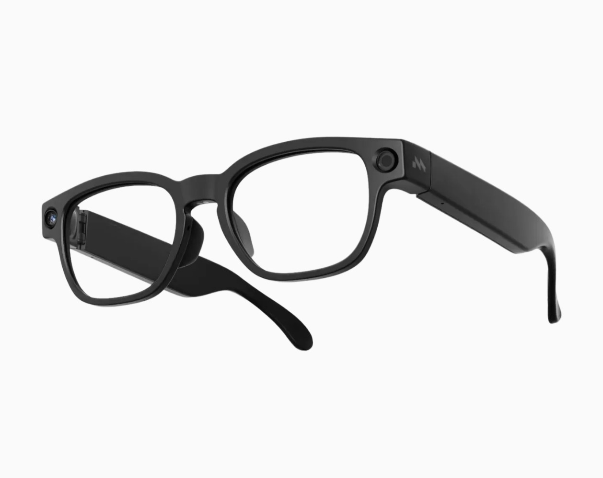

# ロボット研究の未来に、現場から関わってみませんか？

> **アーカイブ資料です。** 「500円×売り先数」、音声を録音しない運用、撮影禁止マーカーなど、現在と異なる条件を含むため配布には使用しません。

日本の現場の作業映像を、ロボット・AIの学習データとして活かす旧営業案内です。RootLensは、国内外の研究開発企業への現場データ提供を提案していました。

## 現場に合わせた機材

| RootCap | RootGlass |
|---|---|
|  |  |
| スマートフォンを頭部に装着する構成 | 軽量なメガネ型の構成 |

## 進め方

1. **撮影** — スタッフがRootCapまたはRootGlassを着用し、作業の様子を撮影します。
2. **提供** — 撮影した映像を、ロボット・AIの研究開発企業へ学習用データとして提供します。
3. **還元** — 同じ映像を複数企業へ販売し、売り先が増えるほど還元も増える旧設計でした。

## 旧還元設計

**500円 × 売り先数 × 承認時間**

映像が1社に売れれば1時間500円、3社なら1,500円とし、承認時間は買い手企業に受け入れられた映像時間を指していました。最初は5時間の試験撮影を案内していました。

## 撮影実績

箕面市のベーカリー「サトウカエデ」で、仕込みや包装などの厨房業務を撮影していました。

## 当時の案内

- 本人の判断でいつでも撮影を開始・停止できること
- 撮影はバックヤード等に限定し、顔をぼかし、音声は録音しないこと
- 専用シールの周囲をぼかすこと

お問い合わせ：RootLens 森 雄大 / contact@rootlens.io / rootlens.io
