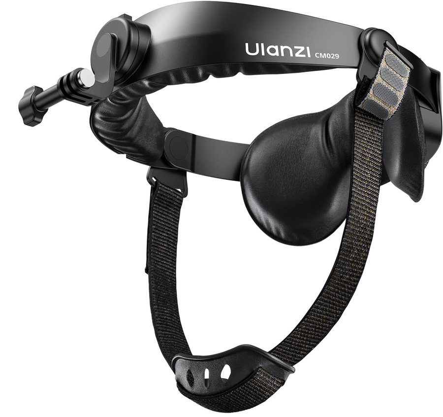

# ヘッドギアで、人件費を大幅に削減できます

> **アーカイブ資料です。** 800円／時の固定単価、音声を録音しない運用など、現在と異なる条件を含むため配布には使用しません。

店舗の作業映像をロボット・AIの学習用データとして活用し、録画時間に応じて撮影協力費を支払う、紹介経由向けの旧営業資料です。

## 進め方

1. **撮影** — スタッフがヘッドギア型カメラを装着し、バックヤードで手元の作業を撮影します。旧運用では顔をぼかし、音声は録音しない設計でした。
2. **データ提供** — ロボットやAIが作業を学習する素材として、研究開発企業へ販売します。
3. **撮影協力費** — 品質基準を満たした録画時間1時間につき800円を、月次で支払う旧条件です。

## 旧試算例

| 項目 | 金額 |
|---|---:|
| 店舗が支払う時給 | 1,200円 |
| 撮影協力費 | −800円 |
| 店舗の実質負担 | 約400円／時 |

録画できる時間は勤務時間の7〜8割を目安とし、データ販売の拡大に合わせて還元額を引き上げる想定でした。

## 当時の案内

- 装着中も両手を空けて通常作業を行えること
- 撮影はバックヤードに限定し、顔をぼかし、音声を録音しないこと
- 撮影を避けたい場所は事前に指定し、外部提供前の確認・削除に応じること

お問い合わせ：RootLens 森 雄大 / contact@rootlens.io / rootlens.io
