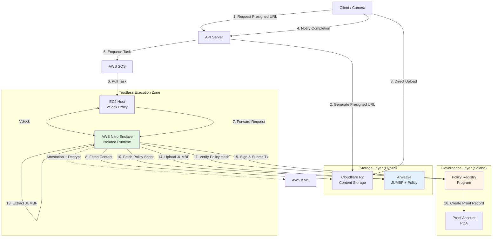

# Phase 2: Trustless TEE Architecture - Complete Design

> **コンセプト: "Trustless Provenance Protocol"**
>
> 「事実はArweave、ルール（ポリシー）はSolana、執行はTEE」
>
> 中央集権的なサーバーの恣意性を排除し、検証ロジック自体の透明性を担保する次世代アーキテクチャ

---

## 📌 背景：なぜTEEが必要か

### 現在のMVP（Phase 1）の限界

**問題**: クライアントから送信される `rootSigner` / `claimGenerator` をそのまま信頼している。

```typescript
// 現在の実装（脆弱）
const proofMetadata = {
  rootSigner: data.rootSigner, // ❌ 検証なし！クライアントの言い値
  claimGenerator: data.claimGenerator,
};
```

**攻撃シナリオ**:
```bash
curl -X POST https://api.rootlens.io/upload \
  -d '{"rootSigner": "Sony Alpha 1", "originalHash": "fake_hash"}'
```
→ 偽造証明がcNFTとして発行される

### Phase 2.0（基本的なサーバー側検証）の限界

`backend-c2pa-verification.md` で計画されている標準的なサーバー側検証でも、以下の信頼が必要：

1. **サーバー管理者**: ワーカーコードを改ざんしないことを信頼
2. **インフラプロバイダ**: Railway/AWSがログを盗み見ないことを信頼
3. **秘密鍵管理**: 環境変数で平文保存された秘密鍵が漏洩しないことを信頼

**これでは真の "Trustless" ではない**

---

## 🎯 Phase 2 Ultimate Goal: Zero-Trust Verification

### 達成目標

| 要素 | Phase 1 (MVP) | Phase 2.0 (Server Verification) | **Phase 2.2 (TEE)** |
|------|---------------|--------------------------------|---------------------|
| C2PA検証場所 | クライアント | サーバー（Docker） | **TEE (Nitro Enclave)** |
| 検証コードの透明性 | なし | GitHub公開 | **オンチェーンハッシュ検証** |
| 秘密鍵の保護 | 環境変数 | 環境変数 | **KMS暗号化 + Attestation** |
| 実行環境の保証 | なし | なし | **Cryptographic Attestation** |
| ポリシー更新の透明性 | なし | なし | **On-chain Governance** |
| **Trustlessness** | ❌ | △ | **✅** |

---

## 🏗 システム全体構成図



---

## 📦 各コンポーネントの詳細設計

### A. TEE: AWS Nitro Enclaves

**役割**: 「見えない・改ざんできない」環境で検証を実行

#### 技術仕様

| 項目 | 仕様 |
|------|------|
| **ランタイム** | Docker Container (Alpine Linux + Node.js 20) |
| **ネットワーク** | ❌ 外部接続なし（VSock Proxyのみ） |
| **ファイルシステム** | Read-Only (イメージに焼き込み) |
| **メモリ** | 512MB〜4GB（設定可能） |
| **CPU** | 2〜16 vCPUs（設定可能） |
| **秘密鍵** | KMS暗号化 → Attestation → メモリ復号のみ |

#### Dockerfile 構造

```dockerfile
# Enclave用の最小イメージ
FROM node:20-alpine

WORKDIR /app

# 依存関係（c2pa-node含む）
COPY package*.json ./
RUN npm ci --production

# 検証ロジック
COPY src/ ./src/

# 暗号化された秘密鍵
COPY encrypted_secrets.bin ./secrets/

# Attestation生成用ツール
RUN apk add --no-cache aws-nitro-enclaves-cli

# VSock通信サーバー起動
CMD ["node", "src/enclave-worker.js"]
```

#### 起動フロー

```typescript
// enclave-worker.js
import { createServer } from 'vsock';
import { KMSClient, DecryptCommand } from '@aws-sdk/client-kms';
import { generateAttestation } from './attestation';

async function initializeSecrets() {
  // 1. Nitro Attestation生成
  const attestation = await generateAttestation();

  // 2. KMSに送信して復号
  const kms = new KMSClient({ region: 'us-east-1' });
  const { Plaintext } = await kms.send(new DecryptCommand({
    CiphertextBlob: fs.readFileSync('./secrets/encrypted_secrets.bin'),
    EncryptionContext: { attestation }
  }));

  // 3. メモリ上でのみ使用（ファイルに書き込まない）
  process.env.SOLANA_PRIVATE_KEY = Plaintext.toString('utf-8');
}

const server = createServer(vsockPort);
server.on('connection', (socket) => {
  socket.on('data', async (data) => {
    const task = JSON.parse(data);
    const result = await processVerification(task);
    socket.write(JSON.stringify(result));
  });
});
```

#### セキュリティ保証

1. **Code Integrity**: PCR0（Platform Configuration Register）にイメージハッシュが記録される
2. **Runtime Isolation**: ホストOSからメモリアクセス不可
3. **Network Isolation**: VSock以外の通信経路なし
4. **Attestation**: KMSが「本物のEnclaveで動作していること」を暗号学的に検証

---

### B. Policy as Code: JavaScript/TypeScript

**役割**: 検証ルールを「コード」として外部化し、透明性とガバナンスを実現

#### なぜJavaScriptか？

| 選択肢 | メリット | デメリット | 採用理由 |
|--------|---------|-----------|---------|
| **On-chain (Anchor)** | 完全分散 | 複雑なロジック困難、コスト高 | ❌ |
| **WASM** | パフォーマンス | 可読性低、デバッグ困難 | ❌ |
| **JavaScript** | 可読性◎、開発速度◎ | 若干遅い | ✅ |

#### Policy Script Example

```javascript
// policy-v1.0.0.js (Arweave上に保存)
export default async function validateC2PA(manifest, options) {
  const { issuer, claimGenerator, actions } = manifest;

  // ホワイトリスト
  const trustedIssuers = [
    'Google LLC',
    'Sony Corporation',
    'Nikon Corporation',
    'Leica Camera AG'
  ];

  // 1. Issuerチェック
  if (!trustedIssuers.some(t => issuer.includes(t))) {
    return { valid: false, reason: 'Untrusted Issuer' };
  }

  // 2. AI生成物の拒否
  const hasAIGeneration = actions.some(a =>
    a.digitalSourceType === 'trainedAlgorithmicMedia'
  );
  if (hasAIGeneration) {
    return { valid: false, reason: 'AI-generated content not allowed' };
  }

  // 3. 条件付き許可（例：特定バージョン以上）
  if (issuer.includes('Google LLC')) {
    const version = parseVersion(claimGenerator);
    if (version < 1.0) {
      return { valid: false, reason: 'Google device version too old' };
    }
  }

  return { valid: true };
}
```

#### ガバナンス設計

```rust
// Solana Program: Policy Registry
#[account]
pub struct PolicyRegistry {
    pub authority: Pubkey,
    pub current_policy_url: String,      // "https://arweave.net/abc..."
    pub current_policy_hash: [u8; 32],   // SHA-256
    pub version: u32,
    pub last_updated: i64,
}

#[derive(Accounts)]
pub struct UpdatePolicy<'info> {
    #[account(mut, has_one = authority)]
    pub registry: Account<'info, PolicyRegistry>,
    pub authority: Signer<'info>,
}

pub fn update_policy(
    ctx: Context<UpdatePolicy>,
    new_url: String,
    new_hash: [u8; 32],
) -> Result<()> {
    let registry = &mut ctx.accounts.registry;
    registry.current_policy_url = new_url;
    registry.current_policy_hash = new_hash;
    registry.version += 1;
    registry.last_updated = Clock::get()?.unix_timestamp;
    Ok(())
}
```

#### TEE側の実行フロー

```typescript
// TEE内のポリシー実行
async function executePolicy(manifest: C2PAManifest) {
  // 1. Solanaから現在のポリシー情報を取得
  const registry = await solana.getAccount('PolicyRegistryPDA');
  const { current_policy_url, current_policy_hash } = registry;

  // 2. Arweaveからスクリプトをダウンロード
  const script = await arweave.fetch(current_policy_url);

  // 3. ハッシュ検証
  const actualHash = sha256(script);
  if (actualHash !== current_policy_hash) {
    throw new Error('Policy hash mismatch - potential tampering!');
  }

  // 4. サンドボックス内で実行
  const vm = new VM({ timeout: 5000, sandbox: { manifest } });
  const result = vm.run(script);

  return result;
}
```

---

### C. Storage Strategy: Hybrid Sidecar Model

**コンセプト**: "Content on R2, Proof on Arweave"

#### なぜハイブリッドか？

| データ種別 | サイズ | 変更頻度 | 重要度 | 最適解 |
|----------|-------|---------|-------|-------|
| **フル画像** | 5MB | 低 | 中 | R2（高速配信） |
| **JUMBF Box** | 50KB | なし | **高** | **Arweave（永続）** |
| **サムネイル** | 200KB | 低 | 低 | R2（コスト削減） |

#### JUMBF抽出処理

```typescript
// TEE内でのJUMBF抽出
import { extractJUMBF } from 'c2pa-node';

async function extractAndStoreProof(contentBuffer: Buffer) {
  // 1. C2PAマニフェスト全体を検証
  const manifest = await c2pa.read(contentBuffer);

  if (!manifest || !manifest.activeManifest) {
    throw new Error('No valid C2PA manifest found');
  }

  // 2. JUMBFボックス（バイナリ）を抽出
  // これはISO/IEC 21122-3で定義されたC2PAの実体
  const jumbfBox = extractJUMBF(contentBuffer);

  // 3. Arweaveへアップロード（永続保存）
  const arweaveTx = await arweave.upload(jumbfBox, {
    tags: [
      { name: 'Content-Type', value: 'application/octet-stream' },
      { name: 'RootLens-Type', value: 'JUMBF-Box' },
      { name: 'Original-Hash', value: sha256(contentBuffer) },
      { name: 'File-Size', value: jumbfBox.length.toString() },
    ]
  });

  return {
    jumbfUrl: `https://arweave.net/${arweaveTx.id}`,
    jumbfHash: sha256(jumbfBox),
    originalHash: sha256(contentBuffer),
  };
}
```

#### 検証時の流れ

```typescript
// 将来的なクライアント検証
async function verifyFromArweave(jumbfUrl: string, currentImage: Buffer) {
  // 1. ArweaveからJUMBFを取得
  const jumbfBox = await fetch(jumbfUrl).then(r => r.arrayBuffer());

  // 2. 現在の画像とJUMBFを結合
  const reconstructed = appendJUMBF(currentImage, jumbfBox);

  // 3. C2PA検証
  const result = await c2pa.read(reconstructed);

  // 4. ハッシュ検証
  const expectedHash = result.activeManifest.assertions['c2pa.hash.data'];
  const actualHash = sha256(currentImage);

  return expectedHash === actualHash;
}
```

#### コスト比較

**シナリオ**: 5MB画像を1年間保存

| 方式 | 初期コスト | 月額コスト | 1年コスト | 備考 |
|------|----------|-----------|---------|------|
| **All Arweave** | $0.25 | $0 | $0.25 | 永続保証◎、高速配信× |
| **All R2** | $0 | $0.075 | $0.90 | 配信◎、永続性△ |
| **Hybrid** | $0.0025 | $0.075 | $0.90 | **両方の利点** |

**Hybridの内訳**:
- R2（5MB画像）: $0.075/月
- Arweave（50KB JUMBF）: $0.0025（永続）

---

### D. Blockchain: Solana Program Design

#### Program構造

```rust
// programs/rootlens-registry/src/lib.rs
use anchor_lang::prelude::*;

declare_id!("RooTxxxxxxxxxxxxxxxxxxxxxxxxxxxxxxxxxxxxx");

#[program]
pub mod rootlens_registry {
    use super::*;

    /// ポリシーレジストリの初期化
    pub fn initialize_registry(ctx: Context<Initialize>) -> Result<()> {
        let registry = &mut ctx.accounts.registry;
        registry.authority = ctx.accounts.authority.key();
        registry.current_policy_url = String::from("");
        registry.current_policy_hash = [0u8; 32];
        registry.version = 0;
        Ok(())
    }

    /// ポリシーの更新（Governance用）
    pub fn update_policy(
        ctx: Context<UpdatePolicy>,
        new_url: String,
        new_hash: [u8; 32],
    ) -> Result<()> {
        let registry = &mut ctx.accounts.registry;
        registry.current_policy_url = new_url;
        registry.current_policy_hash = new_hash;
        registry.version += 1;
        registry.last_updated = Clock::get()?.unix_timestamp;

        emit!(PolicyUpdated {
            version: registry.version,
            policy_hash: new_hash,
            timestamp: registry.last_updated,
        });

        Ok(())
    }

    /// TEEからの証明記録（Attestation付き）
    pub fn record_proof(
        ctx: Context<RecordProof>,
        original_hash: String,
        jumbf_url: String,
        jumbf_hash: [u8; 32],
        enclave_attestation: Vec<u8>,
    ) -> Result<()> {
        // 1. Attestation検証（簡易版）
        require!(
            verify_nitro_attestation(&enclave_attestation),
            ErrorCode::InvalidAttestation
        );

        // 2. Proof Account作成
        let proof = &mut ctx.accounts.proof;
        proof.original_hash = original_hash;
        proof.jumbf_url = jumbf_url;
        proof.jumbf_hash = jumbf_hash;
        proof.verified_at = Clock::get()?.unix_timestamp;
        proof.policy_version = ctx.accounts.registry.version;
        proof.tee_attestation = enclave_attestation;

        Ok(())
    }
}

#[account]
pub struct ProofAccount {
    pub original_hash: String,
    pub jumbf_url: String,
    pub jumbf_hash: [u8; 32],
    pub verified_at: i64,
    pub policy_version: u32,
    pub tee_attestation: Vec<u8>,  // Nitro Attestation Document
}

#[event]
pub struct PolicyUpdated {
    pub version: u32,
    pub policy_hash: [u8; 32],
    pub timestamp: i64,
}
```

#### Attestation検証

```rust
// Nitro Attestation検証（簡易版）
fn verify_nitro_attestation(attestation: &[u8]) -> bool {
    // 1. CBOR Decode
    let doc: AttestationDocument = cbor::from_slice(attestation).ok()?;

    // 2. 署名検証（AWS公開鍵）
    let aws_root_cert = include_bytes!("aws_nitro_root.pem");
    verify_signature(&doc, aws_root_cert)?;

    // 3. PCR検証（期待されるイメージハッシュ）
    let expected_pcr0 = env!("EXPECTED_ENCLAVE_IMAGE_HASH");
    require!(doc.pcrs[0] == expected_pcr0, "PCR mismatch");

    true
}
```

---

## 🔄 データフロー（完全版）

### Step 1: アップロード（Client → R2）

```typescript
// フロントエンド
async function uploadContent(file: File) {
  // 1. Presigned URL取得
  const { presignedUrl, fileId } = await fetch('/api/upload/presigned', {
    method: 'POST',
    body: JSON.stringify({
      filename: file.name,
      contentType: file.type
    })
  }).then(r => r.json());

  // 2. 直接R2へアップロード（APIサーバーを経由しない）
  await fetch(presignedUrl, {
    method: 'PUT',
    body: file,
    headers: { 'Content-Type': file.type }
  });

  // 3. 完了通知
  await fetch('/api/upload/complete', {
    method: 'POST',
    body: JSON.stringify({ fileId })
  });
}
```

### Step 2: キュー投入（API → SQS）

```typescript
// backend API
async function handleUploadComplete(fileId: string) {
  // SQSにタスク投入
  await sqs.sendMessage({
    QueueUrl: process.env.VERIFICATION_QUEUE_URL,
    MessageBody: JSON.stringify({
      fileId,
      r2Key: `uploads/${fileId}`,
      timestamp: Date.now(),
    })
  });
}
```

### Step 3: TEE処理（Worker → Enclave）

```typescript
// EC2 Host: VSock Proxy
import { createConnection } from 'vsock';

async function forwardToEnclave(task: VerificationTask) {
  const socket = createConnection({
    port: 3000,
    cid: 16, // Enclave CID
  });

  return new Promise((resolve) => {
    socket.write(JSON.stringify(task));
    socket.on('data', (data) => {
      resolve(JSON.parse(data));
    });
  });
}

// Enclave内
async function processInEnclave(task: VerificationTask) {
  // 1. R2からコンテンツ取得（Host経由）
  const content = await fetchViaVSock(`/r2/${task.r2Key}`);

  // 2. C2PA検証
  const manifest = await c2pa.read(content);
  if (!manifest) throw new Error('Invalid C2PA');

  // 3. ポリシー取得・検証
  const policy = await fetchPolicyFromSolana();
  const policyScript = await fetchViaVSock(policy.url);
  assert(sha256(policyScript) === policy.hash, 'Policy tampered!');

  // 4. ポリシー実行
  const result = await executePolicy(manifest, policyScript);
  if (!result.valid) throw new Error(result.reason);

  // 5. JUMBF抽出
  const jumbf = extractJUMBF(content);

  // 6. Arweaveアップロード（Host経由）
  const arweaveTx = await uploadViaVSock('/arweave/upload', jumbf);

  // 7. Attestation生成
  const attestation = await generateAttestation();

  // 8. Solanaトランザクション署名
  const tx = await createProofTransaction({
    originalHash: sha256(content),
    jumbfUrl: arweaveTx.url,
    jumbfHash: sha256(jumbf),
    attestation,
  });

  const signedTx = await signWithEnclaveKey(tx);

  // 9. 送信（Host経由）
  await submitViaVSock('/solana/send', signedTx);

  return { success: true, proofId: tx.proofAccount };
}
```

---

## 🔐 セキュリティモデル

### Trust Boundaries

```
┌─────────────────────────────────────────────┐
│         Untrusted Zone                      │
│  - Client Browser                           │
│  - EC2 Host OS                              │
│  - API Server                               │
│  - Network (Internet)                       │
└─────────────────────────────────────────────┘
                    ↓ VSock (Encrypted)
┌─────────────────────────────────────────────┐
│         Trusted Zone (TEE)                  │
│  - AWS Nitro Enclave                        │
│    - C2PA Verification                      │
│    - Policy Execution                       │
│    - Private Key (in memory only)           │
│  - Verified by: Cryptographic Attestation   │
└─────────────────────────────────────────────┘
                    ↓ On-chain Record
┌─────────────────────────────────────────────┐
│         Verifiable Zone                     │
│  - Solana Blockchain                        │
│  - Arweave (JUMBF)                          │
│  - Anyone can verify proof                  │
└─────────────────────────────────────────────┘
```

### 脅威モデルと対策

| 脅威 | 影響 | 対策 |
|------|------|------|
| **悪意ある管理者** | 検証コードを改ざん | ✅ PCR0でイメージハッシュ固定、On-chainで検証 |
| **ホストOS侵害** | メモリダンプで秘密鍵盗聴 | ✅ TEEによるメモリ分離 |
| **ポリシースクリプト改ざん** | 不正なスクリプト実行 | ✅ Solanaでハッシュ検証 |
| **中間者攻撃** | 通信傍受 | ✅ VSock暗号化 + TLS |
| **Replay攻撃** | 古いトランザクション再利用 | ✅ Timestamp + Nonce |
| **DDoS** | サービス停止 | ✅ SQS Rate Limiting + Auto-scaling |

---

## 🗓 開発ロードマップ

### Phase 2.0: Migration（1-2ヶ月）

**目標**: 基本的なサーバー側検証の実装

- [ ] Docker化されたWorkerの構築
- [ ] `c2pa-node` 統合
- [ ] R2 Presigned URLフローの実装
- [ ] Hybrid Storage（R2 + Arweave）への移行
- [ ] JUMBF抽出ロジック

**デプロイ**: Railway → AWS EC2 (t3.medium)

### Phase 2.1: Hardening（2-3ヶ月）

**目標**: TEE環境への移行

- [ ] AWS Nitro Enclavesセットアップ
- [ ] VSock Proxy実装
- [ ] KMS統合（秘密鍵暗号化）
- [ ] Attestation生成・検証
- [ ] Read-only Dockerfile構築

**デプロイ**: EC2 (c6a.xlarge + Enclave)

### Phase 2.2: Governance（3-4ヶ月）

**目標**: 完全分散ガバナンス

- [ ] Solana Program開発（Anchor）
  - [ ] Policy Registry
  - [ ] Proof Account
  - [ ] Attestation Verification
- [ ] Policy as Code実装
  - [ ] JavaScript実行環境（VM）
  - [ ] サンドボックス化
- [ ] Arweave Policy管理UI
- [ ] Multi-sig Authority（DAO準備）

**デプロイ**: Solana Mainnet + Production Enclave

### Phase 2.3: Optimization（4-6ヶ月）

**目標**: スケーラビリティとコスト最適化

- [ ] Auto-scaling（SQS Queue Depth based）
- [ ] Spot Instanceの活用
- [ ] Enclave Image最適化（サイズ削減）
- [ ] Policy Caching
- [ ] Batch Processing

---

## 💰 コスト分析

### インフラコスト（月間1万件処理時）

| コンポーネント | スペック | 単価 | 月額コスト |
|--------------|---------|------|----------|
| **EC2 (c6a.xlarge)** | 4 vCPU, 8GB RAM | $0.153/hr | $110 |
| **Nitro Enclave** | 2 vCPU, 4GB RAM | 追加料金なし | $0 |
| **SQS** | 1万リクエスト | $0.40/100万 | $0.004 |
| **KMS** | 1万リクエスト | $0.03/1万 | $0.03 |
| **R2 Storage** | 50GB | $0.015/GB | $0.75 |
| **Arweave** | 500MB (JUMBF) | $0.05/GB | $0.025 |
| **Data Transfer** | 50GB egress | $0 (R2) | $0 |
| **合計** | - | - | **$110.8/月** |

### 1件あたりコスト

```
$110.8 ÷ 10,000件 = $0.011/件
```

**内訳**:
- コンピュート: $0.011
- cNFT Mint: $0.00005
- Arweave (JUMBF): $0.0025
- **合計: $0.01355/件**

### スケール時のコスト効率

| 月間処理数 | EC2台数 | 月額コスト | 1件あたりコスト |
|----------|--------|----------|---------------|
| 1,000 | 1 | $111 | $0.111 |
| 10,000 | 1 | $111 | $0.011 |
| 100,000 | 3 | $330 | $0.0033 |
| 1,000,000 | 20 | $2,200 | $0.0022 |

→ **規模の経済が効く設計**

---

## 🚀 技術的課題と解決策

### Challenge 1: Attestation検証のガスコスト

**問題**: Nitro AttestationはCBOR形式で数KB。Solana上で検証するとガスコストが高い。

**解決策**:
```rust
// 完全検証ではなく「ハッシュ検証」のみをオンチェーン化
pub fn record_proof(
    ctx: Context<RecordProof>,
    attestation_hash: [u8; 32], // ← ハッシュのみ渡す
) -> Result<()> {
    // オフチェーンで検証済みであることを前提
    // 必要に応じてAttestationのフルデータはArweaveへ
    proof.attestation_hash = attestation_hash;
    Ok(())
}
```

### Challenge 2: Policy Script実行の脆弱性

**問題**: 任意のJavaScriptを実行することのリスク。

**解決策**:
```typescript
// 厳格なサンドボックス化
import { VM } from 'vm2';

const vm = new VM({
  timeout: 5000,
  sandbox: {
    // 許可されたAPIのみ公開
    manifest: sanitizedManifest,
    console: { log: () => {} }, // ログ無効化
  },
  eval: false,
  wasm: false,
  // ファイルシステムアクセス禁止
  require: {
    external: false,
  }
});
```

### Challenge 3: Enclave起動時間

**問題**: Enclaveの起動に10-30秒かかる。

**解決策**:
- **Warm Pool**: 常に2-3個のEnclaveを起動状態で待機
- **Keep-alive**: タスク処理後も10分間は起動状態を維持
- **Auto-scaling**: SQS滞留数に応じて事前スケールアップ

---

## 📊 競合比較

| プロジェクト | TEE使用 | Policy Governance | JUMBF Separation | Trustlessness |
|------------|--------|------------------|------------------|---------------|
| **Truepic Vision** | ❌ | ❌ (Centralized) | ❌ | ❌ |
| **Numbers Protocol** | ❌ | ❌ (Centralized) | ❌ | △ (IPFS) |
| **Starling Lab** | ❌ | ❌ | ❌ | △ (Filecoin) |
| **RootLens Phase 2.2** | ✅ Nitro | ✅ On-chain | ✅ Arweave | **✅** |

---

## 🎯 まとめ

### Phase 2で達成できること

1. **完全なTrustlessness**: サーバー管理者すら証明を改ざんできない
2. **透明なガバナンス**: ポリシー更新がオンチェーンで追跡可能
3. **長期的な検証可能性**: JUMBFがArweaveで永続保存
4. **スケーラビリティ**: Auto-scaling + Spot Instanceで低コスト

### 実現可能性

| 要素 | 難易度 | 期間 | リスク |
|------|-------|------|-------|
| TEE統合 | 高 | 2-3ヶ月 | 学習コスト |
| Policy as Code | 中 | 1-2ヶ月 | セキュリティ |
| Solana Program | 中 | 2-3ヶ月 | 監査必要 |
| JUMBF抽出 | 低 | 1週間 | 仕様理解 |

**総合難易度**: ★★★★☆（高いが実現可能）

---

## 📚 参考資料

- [AWS Nitro Enclaves Documentation](https://docs.aws.amazon.com/enclaves/)
- [C2PA Specification](https://c2pa.org/specifications/)
- [JUMBF (ISO/IEC 21122-3)](https://www.iso.org/standard/74645.html)
- [Anchor Framework](https://www.anchor-lang.com/)
- [Arweave SDK](https://github.com/ArweaveTeam/arweave-js)

---

**Last Updated**: 2025-12-23
**Document Version**: 1.0.0
**Status**: Planning Phase
